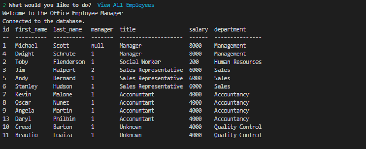

# Employee Manager App 1.0

## Description
This application allow you to manage a company database, including the employees, their roles and their departments. It allows you to create, view and update the info that you want to have i.e see employees by manager  or see the departments. It uses MYSQL as database server and inquier to ask the questions  or interact with the user, also is using console.table for better visualization of the data. 

## Table of Contents

- [Installation](#installation)
- [Usage](#usage)
- [Licence](#licence)

## Installation
First you have to clone the repo, run the seed.db file loging into mysql with your account and writing db/seed.sql and then you have to run the code typing node server.js and choose the option that you want.

## Usage
If you want to add an employee you have to choose that option and then bring his/her first name, last name, role id (be sure to check the roles table first) and his/her manager id.

## Licence
The Unlicense

## Questions
[Github Profile](https://github.com/braulioloaizac)

Email : bloaizac@uqvirtual.edu.co

[Click here to see the app in action (Video)](https://drive.google.com/file/d/1Jc-BPaByJrRndvbH2qHThCoRCNvGbDYq/view)

